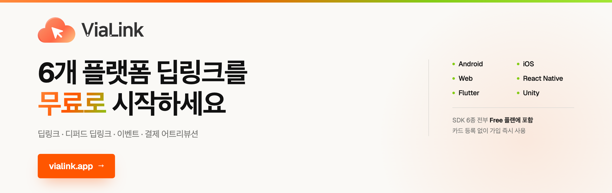

# ViaLink React Native SDK

[](https://vialink.app)

[English](README.md) | **한국어**

ViaLink 딥링크 인프라 서비스를 위한 React Native SDK입니다.
v2.0부터 네이티브 브릿지 방식(Android .aar + iOS .xcframework)으로 동작합니다.

Android · iOS 네이티브 SDK를 그대로 감싼 브릿지라, TypeScript 코드 한 벌로 양쪽 플랫폼의
딥링크와 디퍼드 딥링킹을 처리합니다. 앱이 없으면 스토어로 보낸 뒤 설치 후 첫 실행에서
원래 화면으로 연결하고, 클릭 → 설치 → 실행 → 이벤트 → 결제를 어트리뷰션으로 잇습니다.

많은 딥링크 · 어트리뷰션 도구가 영업 문의와 연간 계약을 요구하는 것과 달리
**ViaLink는 무료로 시작합니다.** 카드 등록 없이, 가입 즉시 6개 플랫폼 SDK를 모두 쓸 수 있습니다.

**→ [vialink.app](https://vialink.app)**

## 특징

- **딥링크 라우팅** — App Links / Universal Links 자동 처리
- **디퍼드 딥링킹** — 앱 설치 후 첫 실행 시 핑거프린트 기반 매칭
- **이벤트 추적** — 커스텀 이벤트 배치 전송
- **결제 어트리뷰션** — 결제 시도 기록 + 자동 link_id 첨부
- **링크 생성** — 앱 내에서 딥링크 생성 (static/dynamic)

## 요구사항

- React Native 0.73+
- Android: minSdk 24, compileSdk 34
- iOS: 15.0+, Swift 5.9+

## 설치

```bash
npm install vialink-react-native-sdk
```

### iOS 추가 설정

```bash
cd ios && pod install
```

### Android 추가 설정

`android/app/build.gradle`에서 설정 확인:

```groovy
android {
    compileSdkVersion 34
    defaultConfig {
        minSdkVersion 24
    }
}
```

`MainApplication.kt` (또는 `.java`)에 패키지 등록:

```kotlin
import com.vialink.reactnative.ViaLinkPackage

override fun getPackages(): List<ReactPackage> {
    val packages = PackageList(this).packages.toMutableList()
    packages.add(ViaLinkPackage())
    return packages
}
```

## 사용법

### 1. 초기화

```typescript
import { ViaLinkSDK } from 'vialink-react-native-sdk';

// App.tsx 최상위에서 호출
await ViaLinkSDK.shared.configure('YOUR_API_KEY');
```

### 2. 딥링크 콜백

```typescript
// App Links / Universal Links 수신
ViaLinkSDK.shared.onDeepLink((data) => {
  console.log('딥링크:', data.path, data.params);
  navigation.navigate(data.path, data.params);
});

// 디퍼드 딥링크 (앱 첫 실행 시 매칭, 5초 데드라인)
ViaLinkSDK.shared.onDeferredDeepLink((data, error) => {
  if (error) {
    // 매칭 실패 (timeout/network/server_error 등) — 일반 진입
    console.log('매칭 실패:', error.code, error.message);
    return;
  }
  if (!data) {
    // organic install — 일반 진입
    return;
  }
  // 매칭 성공 — 딥링크 경로로 이동
  navigation.navigate(data.path, data.params);
});
```

### 3. Pull API

```typescript
// 동기 (캐시된 값 즉시 반환)
const deepLink = await ViaLinkSDK.shared.getDeepLinkData();
const deferred = await ViaLinkSDK.shared.getDeferredLinkData();

// 비동기 (결과 도착까지 대기)
const deepLinkAsync = await ViaLinkSDK.shared.awaitDeepLinkData();    // 3초 타임아웃
const deferredAsync = await ViaLinkSDK.shared.awaitDeferredLinkData(); // 결과까지 대기
```

### 4. 이벤트 추적

```typescript
ViaLinkSDK.shared.track('purchase', {
  product_id: '12345',
  revenue: 29900,
  currency: 'KRW',
});
```

### 5. 결제 추적

```typescript
const result = await ViaLinkSDK.shared.payment.initiated({
  orderId: 'ORD-2026-0001',
  amount: 19900,
  currency: 'KRW',
  paymentMethod: 'card',
});
console.log('success:', result.success, 'id:', result.paymentEventId);
```

### 6. 링크 생성

```typescript
const url = await ViaLinkSDK.shared.createLink(
  '/product/123',
  { promo_code: 'FRIEND_SHARE' },
  'referral',
  'dynamic', // 클릭 추적 필요 시
);
console.log('생성된 링크:', url);
```

### 7. 정리

```typescript
// 앱 종료 또는 unmount 시
ViaLinkSDK.shared.destroy();
```

## 샘플 프로젝트

`sample/` 디렉토리에서 실행 가능한 샘플 앱을 확인하세요.

## 문서

- [SDK 가이드](https://docs.vialink.app/#sdk-react-native-install)

## 라이선스

MIT License — Aresjoy Inc.
