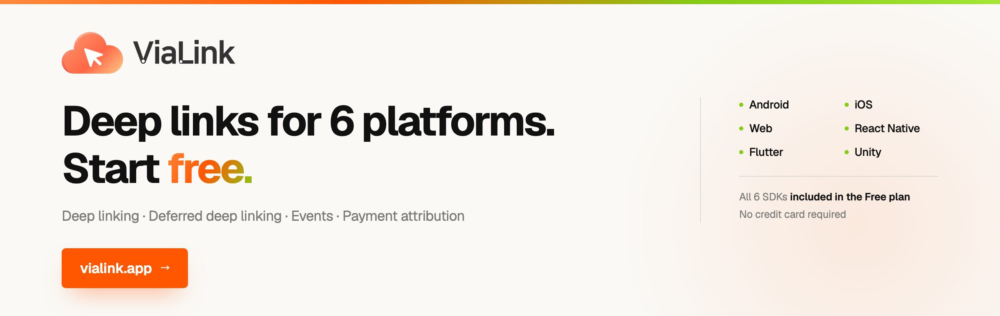

# ViaLink React Native SDK

[](https://vialink.app)

**English** | [한국어](README.ko.md)

React Native SDK for the ViaLink deep link infrastructure service.
Since v2.0 it runs through a native bridge (Android .aar + iOS .xcframework).

Built as a bridge over the native Android and iOS SDKs, so a single TypeScript codebase
handles deep linking and deferred deep linking on both platforms. Users who install from
a link land on the intended screen at first launch, and click, install, open, event, and
payment flow through one attribution pipeline.

Unlike most deep link and attribution tools, which require a sales call and an annual
contract, **ViaLink is free to start.** No credit card — all six platform SDKs are
available the moment you sign up.

**→ [vialink.app](https://vialink.app)**

## Features

- **Deep link routing** — automatic handling of App Links / Universal Links
- **Deferred deep linking** — fingerprint-based matching on the first launch after install
- **Event tracking** — batched delivery of custom events
- **Payment attribution** — records payment attempts and automatically attaches `link_id`
- **Link creation** — generate deep links from within the app (static/dynamic)

## Requirements

- React Native 0.73+
- Android: minSdk 24, compileSdk 34
- iOS: 15.0+, Swift 5.9+

## Installation

```bash
npm install vialink-react-native-sdk
```

### iOS additional setup

```bash
cd ios && pod install
```

### Android additional setup

Verify the configuration in `android/app/build.gradle`:

```groovy
android {
    compileSdkVersion 34
    defaultConfig {
        minSdkVersion 24
    }
}
```

Register the package in `MainApplication.kt` (or `.java`):

```kotlin
import com.vialink.reactnative.ViaLinkPackage

override fun getPackages(): List<ReactPackage> {
    val packages = PackageList(this).packages.toMutableList()
    packages.add(ViaLinkPackage())
    return packages
}
```

## Usage

### 1. Initialization

```typescript
import { ViaLinkSDK } from 'vialink-react-native-sdk';

// Call at the top level of App.tsx
await ViaLinkSDK.shared.configure('YOUR_API_KEY');
```

### 2. Deep link callbacks

```typescript
// Receive App Links / Universal Links
ViaLinkSDK.shared.onDeepLink((data) => {
  console.log('deep link:', data.path, data.params);
  navigation.navigate(data.path, data.params);
});

// Deferred deep link (matched on first app launch, 5-second deadline)
ViaLinkSDK.shared.onDeferredDeepLink((data, error) => {
  if (error) {
    // match failed (timeout/network/server_error, etc.) — normal entry
    console.log('match failed:', error.code, error.message);
    return;
  }
  if (!data) {
    // organic install — normal entry
    return;
  }
  // match succeeded — navigate to the deep link path
  navigation.navigate(data.path, data.params);
});
```

### 3. Pull API

```typescript
// Synchronous (returns the cached value immediately)
const deepLink = await ViaLinkSDK.shared.getDeepLinkData();
const deferred = await ViaLinkSDK.shared.getDeferredLinkData();

// Asynchronous (waits until the result arrives)
const deepLinkAsync = await ViaLinkSDK.shared.awaitDeepLinkData();    // 3-second timeout
const deferredAsync = await ViaLinkSDK.shared.awaitDeferredLinkData(); // waits until the result
```

### 4. Event tracking

```typescript
ViaLinkSDK.shared.track('purchase', {
  product_id: '12345',
  revenue: 29900,
  currency: 'KRW',
});
```

### 5. Payment tracking

```typescript
const result = await ViaLinkSDK.shared.payment.initiated({
  orderId: 'ORD-2026-0001',
  amount: 19900,
  currency: 'KRW',
  paymentMethod: 'card',
});
console.log('success:', result.success, 'id:', result.paymentEventId);
```

### 6. Link creation

```typescript
const url = await ViaLinkSDK.shared.createLink(
  '/product/123',
  { promo_code: 'FRIEND_SHARE' },
  'referral',
  'dynamic', // when click tracking is needed
);
console.log('created link:', url);
```

### 7. Cleanup

```typescript
// On app shutdown or unmount
ViaLinkSDK.shared.destroy();
```

## Sample project

See the runnable sample app in the `sample/` directory.

## Documentation

- [SDK Guide](https://docs.vialink.app/sdk/react-native)

## License

MIT License — Aresjoy Inc.
